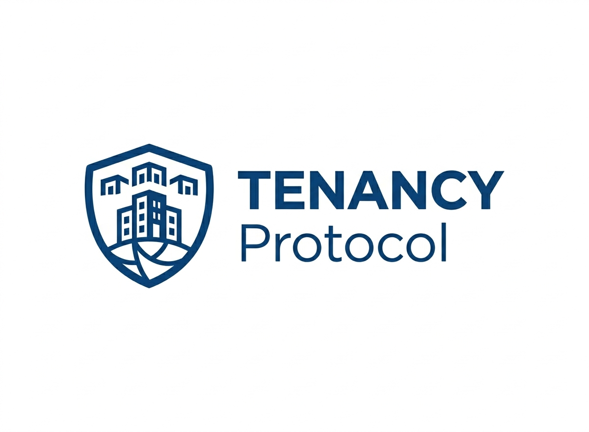
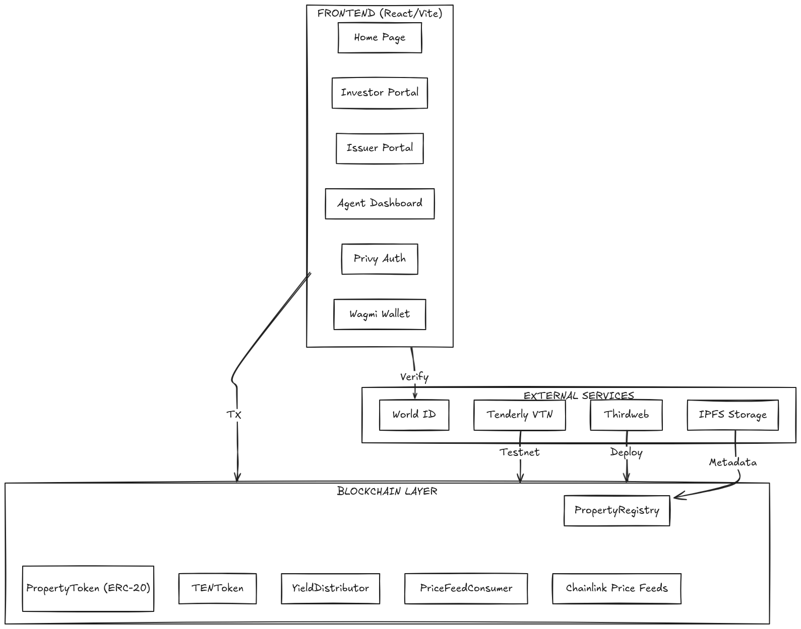
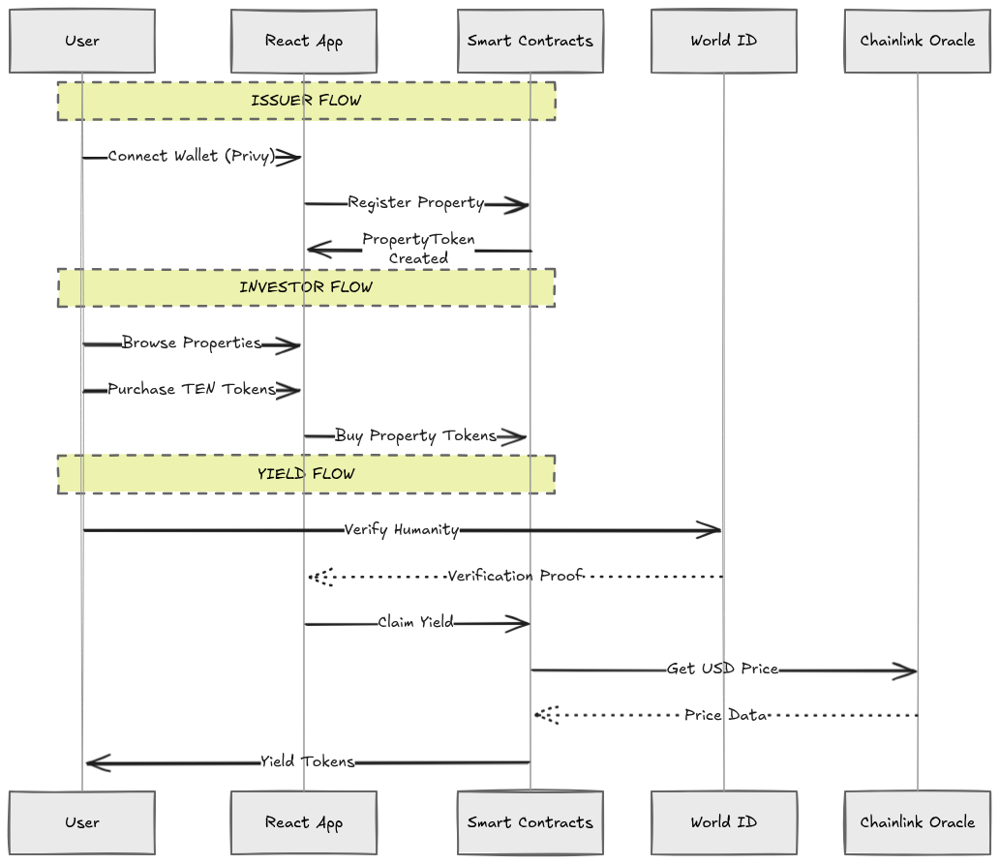
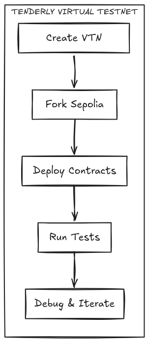

# TENANCY Protocol

<p align="center">
  
</p>

<p align="center">
  
  
  
  
  
  
</p>

> **TENANCY** tokenizes real-estate rental properties as ERC-20 tokens representing rental income rights. Features gas-efficient immediate marketplace listing, Chainlink CRE verification, and automated yield distribution.

**🎯 Latest Deployment: March 2026 - Base Sepolia Testnet**  
**⚡ New Feature: Immediate Property Listing (25% gas savings)**

Built for the **Chainlink Convergence Hackathon** — a fully functional DeFi protocol bringing real-world rental income on-chain.

---

## 📋 Table of Contents

- [System Architecture](#system-architecture)
- [User Flow](#user-flow)
- [Features](#features)
- [Tech Stack](#tech-stack)
- [Project Structure](#project-structure)
- [Quick Start](#quick-start)
- [Environment Variables](#environment-variables)
- [Smart Contracts](#smart-contracts)
- [Chainlink Integration](#chainlink-integration)
- [Frontend](#frontend)
- [Backend](#backend)
- [Deployment Options](#deployment-options)
- [Thirdweb Integration](#thirdweb-integration)
- [Tenderly Virtual TestNet](#tenderly-virtual-testnet)
- [CRE Workflow](#cre-workflow)
- [Testing](#testing)
- [Security](#security)
- [Roadmap](#roadmap)
- [Support](#support)
- [Contributing](#contributing)
- [License](#license)

---

## 🏗️ System Architecture

### Visual Design

<p align="center">
  
</p>

### Flowchart Design

<p align="center">
  
</p>

### Deployment Design

<p align="center">
  
</p>


---

## 🔄 User Flow

```
┌─────────────────────────────────────────────────────────────────────────────────────┐
│                              USER FLOW DIAGRAM                                      │
├─────────────────────────────────────────────────────────────────────────────────────┤
│                                                                                     │
│  ┌──────────────────┐                                                               │
│  │    USER TYPES    │                                                               │
│  ├──────────────────┤                                                               │
│  │                  │                                                               │
│  │  ┌──────────┐    │    ┌────────────┐    ┌───────────┐                            │
│  │  │  ISSUER  │◀───┼───▶│  TENANT    │◀───│ INVESTOR  │                           │
│  │  │(Property │    │    │  (Renter)  │    │ (Token    │                            │
│  │  │ Owner)   │    │    │            │    │  Buyer)   │                            │
│  │  └──────────┘    │    └────────────┘    └───────────┘                            │
│  │                  │                                                               │
│  │  • Tokenize      │                                                               │
│  │  • Deposit Yield │                                                               │
│  │  • Manage Props  │                                                               │
│  └──────────────────┘                                                               │
│                                                                                     │
└─────────────────────────────────────────────────────────────────────────────────────┘
```

### ISSUER FLOW

```
1. CONNECT WALLET
   └─▶ Sign in with Privy (email/wallet)

2. REGISTER PROPERTY
   ├─▶ Enter property address
   ├─▶ Set monthly rent (USDC)
   ├─▶ Choose stream duration
   └─▶ Provide lease proof URL (IPFS)

3. OFF-CHAIN VERIFICATION (CRE)
   ├─▶ Backend receives verification request
   ├─▶ Mock API simulates payment status check
   └─▶ Returns verification ID

4. ON-CHAIN PROPERTY CREATION
   ├─▶ PropertyRegistry.createProperty()
   ├─▶ New PropertyToken (ERC-20) minted
   ├─▶ Property added to registry
   └─▶ Issuer receives tokens

5. CHAINLINK VERIFICATION (Optional)
   ├─▶ Trigger mock Chainlink job
   ├─▶ depositYield() called
   └─▶ Yield distributed to investors
```

### INVESTOR FLOW

```
1. CONNECT WALLET
   └─▶ Sign in with Privy (email/wallet)

2. BROWSE PROPERTIES
   ├─▶ View available property tokens
   ├─▶ See APY, property value, rent
   └─▶ Select property to invest

3. PURCHASE TOKEN RIGHTS
   ├─▶ Swap USDC for TEN tokens
   ├─▶ Price from Chainlink Oracle
   ├─▶ Receive PropertyToken
   └─▶ Fractional ownership of rental income

4. YIELD ACCUMULATION
   ├─▶ Tenants make rent payments
   ├─▶ CRE workflow verifies off-chain
   ├─▶ Yield deposited to YieldDistributor
   └─▶ Investor's share calculated by token balance

5. CLAIM YIELD
   ├─▶ View pending yield in dashboard
   ├─▶ Click "Claim All Yields"
   ├─▶ YieldDistributor.claimYield()
   └─▶ Receive TEN tokens
```

### AUTOMATED FLOW (CRE)

```
TRIGGER: Cron (Daily 00:00 UTC) OR Event (PaymentReceived)

STEP 1: FETCH PAYMENTS
   └─▶ HTTP GET /api/payments/{propertyId}

STEP 2: VERIFY
   ├─▶ Check transaction exists
   ├─▶ Validate amount matches rent
   └─▶ Confirm timestamp

STEP 3: CONSENSUS
   ├─▶ Multiple node operators verify independently
   ├─▶ Threshold-based agreement
   └─▶ Reject if payment failed

STEP 4: ON-CHAIN EXECUTE
   ├─▶ YieldDistributor.depositYield(propertyId, amount)
   ├─▶ YieldDistributor.distributeYield(distributionId)
   └─▶ Emit YieldDistributed event
```

---

## ✨ Features

### Core Protocol
- **Property Tokenization**: Convert rental income streams into ERC-20 tokens
- **Fractional Ownership**: Multiple investors can hold shares of a single property
- **Yield Distribution**: Automatic yield distribution proportional to token holdings
- **Price Feeds**: Real-time ETH/USD pricing via Chainlink

### Chainlink Integration
- **CRE Workflow**: Off-chain payment verification → On-chain yield distribution
- **Price Feeds**: ETH/USD for property valuation and yield calculation
- **Automation**: Scheduled or event-triggered workflow execution

### Frontend
- **Privy Auth**: Wallet + Email login
- **Wallet Modal**: Shows address, balance, network
- **Modern UI**: Devfolio-inspired design with generous spacing
- **Responsive**: Works on desktop and mobile

---

## 🛠 Tech Stack

| Layer | Technology |
|-------|------------|
| **Smart Contracts** | Solidity, Foundry, OpenZeppelin |
| **Chain Integration** | Chainlink CRE, Chainlink Price Feeds |
| **Frontend** | React 19, Vite, TypeScript, Tailwind CSS |
| **UI Components** | Radix UI, Lucide React |
| **Authentication** | Privy |
| **Deployment** | Thirdweb, Tenderly Virtual TestNet |
| **Backend** | Express.js (Mock) |
| **Workflow** | TypeScript, Node.js |

---

## 📁 Project Structure

```
Tenancy/
├── contracts/                 # Foundry smart contracts
│   ├── src/
│   │   ├── PropertyRegistry.sol    # Property management & token minting
│   │   ├── PropertyToken.sol      # ERC-20 per property
│   │   ├── TENToken.sol           # Protocol utility token
│   │   ├── YieldDistributor.sol   # Yield distribution logic
│   │   └── PriceFeedConsumer.sol  # Chainlink price feed
│   ├── script/
│   │   └── DeployTENANCY.s.sol    # Deployment script
│   ├── test/
│   │   ├── TENANCY.t.sol          # Main test suite
│   │   └── Counter.t.sol          # Counter tests
│   └── foundry.toml              # Foundry config
│
├── cre-workflow/               # Chainlink CRE workflow
│   ├── src/
│   │   └── workflow.ts           # Workflow implementation
│   ├── .env                      # Environment config
│   ├── package.json
│   └── README.md                 # CRE-specific docs
│
├── src/                       # Frontend React app
│   ├── components/
│   │   ├── Layout.tsx           # Main layout with nav
│   │   └── StatCard.tsx          # Stats display card
│   ├── pages/
│   │   ├── Home.tsx             # Landing/dashboard
│   │   ├── Investor.tsx         # Investor portal
│   │   └── Issuer.tsx           # Issuer portal
│   ├── lib/
│   │   ├── AuthContext.tsx      # Privy auth context
│   │   ├── contracts.ts         # Contract addresses & config
│   │   └── api.ts              # Backend API calls
│   ├── App.tsx                  # Main app component
│   ├── index.tsx               # Entry point
│   └── vite-env.d.ts           # TypeScript env types
│
├── server/                    # Mock backend
│   ├── index.js               # Express server
│   └── package.json
│
├── dist/                      # Built frontend
├── public/                    # Static assets
├── package.json              # Root package.json (frontend)
├── vite.config.ts            # Vite config
├── tailwind.config.cjs       # Tailwind config
├── tsconfig.json             # TypeScript config
├── eslint.config.js          # ESLint config
├── postcss.config.cjs       # PostCSS config
├── index.html                # HTML entry
└── styles.css               # Global styles
```

---

## 🚀 Quick Start

### Prerequisites

- **Node.js** 18+
- **npm** or **yarn**
- **Git**
- **MetaMask** or **WalletConnect** compatible wallet

### Installation

```bash
# Clone repository
git clone https://github.com/Moses-main/Tenancy.git
cd Tenancy

# Install frontend dependencies
npm install

# Install contract dependencies
cd contracts
forge install
cd ..

# Install backend dependencies
cd server
npm install
cd ..

# Bootstrap environment files (.env and server/.env)
npm run setup:env
```

### Running Locally

```bash
# Terminal 1: Start mock backend
cd server
npm start

# Terminal 2: Start frontend
npm run dev

# Terminal 3 (optional): Start CRE workflow
cd cre-workflow
npm run simulate
```

### Building

```bash
# Frontend production build
npm run build

# Smart contracts
cd contracts
forge build

# Run tests
forge test
```

---

## 🔐 Environment Variables

Create env files from templates:

```bash
npm run setup:env
```

This creates:
- `.env` from `.env.example` (frontend + deployment values)
- `server/.env` from `server/.env.example` (backend values)

Then edit the generated files with your real credentials.

Root `.env` example:

```env
# ============================================================================
# PRIVY AUTHENTICATION
# ============================================================================
# Get your app ID from https://dashboard.privy.io
VITE_PRIVY_APP_ID=your_app_id_here

# ============================================================================
# BACKEND API
# ============================================================================
# Mock backend URL (for local development)
VITE_BACKEND_URL=http://localhost:4010

# ============================================================================
# SMART CONTRACTS - SEPOLIA TESTNET
# ============================================================================
# Deploy contracts and fill these after deployment
VITE_PROPERTY_REGISTRY_SEPOLIA=0x...
VITE_TEN_TOKEN_SEPOLIA=0x...
VITE_YIELD_DISTRIBUTOR_SEPOLIA=0x...

# Chainlink ETH/USD Price Feed (Sepolia)
# Already deployed by Chainlink - no need to change
# ETH/USD: 0x694580A4e26D2b2e2dEk42D32D8d5f0F27C3B92

# ============================================================================
# SMART CONTRACTS - MAINNET (Optional - for production)
# ============================================================================
VITE_PROPERTY_REGISTRY_MAINNET=0x...
VITE_TEN_TOKEN_MAINNET=0x...
VITE_YIELD_DISTRIBUTOR_MAINNET=0x...
```

### Getting Environment Values

1. **VITE_PRIVY_APP_ID**: Sign up at [Privy Dashboard](https://dashboard.privy.io) and create a new app
2. **Contract Addresses**: Deploy contracts (see below) and copy the addresses
3. **VITE_BACKEND_URL**: Default is `http://localhost:4010` for local development

---

## 📜 Smart Contracts

### Contract Overview

| Contract | Purpose | Key Functions |
|----------|---------|---------------|
| `PropertyRegistry` | Property management | `createProperty()`, `getProperty()`, `getAllProperties()` |
| `PropertyToken` | Per-property ERC-20 | Standard ERC-20 + mint/burn |
| `TENToken` | Protocol token | `mint()`, `burn()` |
| `YieldDistributor` | Yield distribution | `depositYield()`, `distributeYield()`, `claimYield()` |
| `PriceFeedConsumer` | Chainlink integration | `getLatestPrice()` |

### Deployment

```bash
cd contracts

# Build contracts
forge build

# Deploy to Sepolia (replace with your RPC and private key)
forge script script/DeployTENANCY.s.sol:DeployTENANCY \
  --rpc-url https://rpc.sepolia.org \
  --private-key 0x... \
  --broadcast \
  --verify

# Or use Anvil for local development
anvil
```

---

## ⛓ Chainlink Integration

### Price Feeds

We use Chainlink Price Feeds for:

- **Property Valuation**: Convert ETH values to USD
- **Yield Calculation**: Calculate yields in USD terms
- **Token Pricing**: Display token values in USD

**Sepolia ETH/USD**: `0x694AA1769357215DE4FAC081bf1f309aDC325306`

#### Files Using Chainlink Price Feeds:

| File | Description |
|------|-------------|
| [`contracts/src/YieldDistributor.sol`](contracts/src/YieldDistributor.sol) | ETH/USD price feed integration, USD/ETH conversion |
| [`contracts/src/PriceFeedConsumer.sol`](contracts/src/PriceFeedConsumer.sol) | Price feed consumer for property valuation |
| [`contracts/src/PropertyRegistry.sol`](contracts/src/PropertyRegistry.sol) | Uses price feed for property valuation |
| [`contracts/script/DeployTENANCY.s.sol`](contracts/script/DeployTENANCY.s.sol) | Deployment with price feed addresses |
| [`scripts/thirdweb-deploy.ts`](scripts/thirdweb-deploy.ts) | Thirdweb deployment with price feeds |
| [`scripts/tenderly-deploy.ts`](scripts/tenderly-deploy.ts) | Tenderly Virtual TestNet deployment |

### Deployment Scripts

#### Thirdweb Deployment

Deploy contracts using Thirdweb SDK for simplified deployment and management:

```bash
# Install dependencies
npm install

# Deploy to Sepolia
npm run deploy:thirdweb

# Deploy to Base Sepolia
NETWORK=base-sepolia npm run deploy:thirdweb
```

**Configuration:**
- Set `PRIVATE_KEY` in `.env`
- Set `NETWORK=sepolia` or `NETWORK=base-sepolia`

#### Tenderly Virtual TestNet

Deploy to Tenderly Virtual TestNet for testing with fork state:

```bash
# Set up Tenderly credentials in .env
TENDERLY_API_KEY=your_api_key
TENDERLY_ACCOUNT_ID=your_account_id

# Deploy to Virtual TestNet
npm run deploy:tenderly

# Test on Virtual TestNet
npm run test:tenderly
```

**Files:**
- [`scripts/thirdweb-deploy.ts`](scripts/thirdweb-deploy.ts) - Thirdweb deployment script
- [`scripts/tenderly-deploy.ts`](scripts/tenderly-deploy.ts) - Tenderly Virtual TestNet deployment

### CRE Workflow

The Chainlink Runtime Environment (CRE) workflow handles:

1. **Trigger**: Cron schedule (Daily 00:00 UTC) or HTTP event
2. **Fetch**: HTTP request to payment API (Confidential HTTP)
3. **Verify**: Validate payment status
4. **AI Analysis**: LLM-powered decision making (OpenAI/Groq)
5. **Consensus**: Multiple node verification
6. **Execute**: Call smart contract to distribute yield

#### Autonomous Rental Agent Workflow

The **AutonomousRentalAgent** is a sophisticated CRE workflow that autonomously manages rental properties:

| File | Description |
|------|-------------|
| [`cre-workflow/workflows/AutonomousRentalAgent/workflow.yaml`](cre-workflow/workflows/AutonomousRentalAgent/workflow.yaml) | Workflow definition with cron trigger |
| [`cre-workflow/workflows/AutonomousRentalAgent/workflow.ts`](cre-workflow/workflows/AutonomousRentalAgent/workflow.ts) | Full TypeScript implementation |
| [`cre-workflow/workflows/AutonomousRentalAgent/secrets.yaml`](cre-workflow/workflows/AutonomousRentalAgent/secrets.yaml) | Secrets configuration |
| [`cre-workflow/workflows/AutonomousRentalAgent/simulate.ts`](cre-workflow/workflows/AutonomousRentalAgent/simulate.ts) | Local simulation |

**Workflow Features:**
- Daily autonomous execution at 00:00 UTC
- Confidential HTTP for payment & market data APIs
- AI-powered decision making via LLM (OpenAI/Groq)
- On-chain execution of decisions
- AIRecommendation event emissions
- Proof-of-Reserve health checks

**Decision Types:**
- `distribute_yield` - Pay out yield to investors
- `pause_yield` - Pause distributions for property
- `adjust_rent` - Change rent amount
- `flag_default` - Mark tenant as in default

#### CRE Workflow Files:

| File | Description |
|------|-------------|
| [`cre-workflow/src/index.ts`](cre-workflow/src/index.ts) | Main CRE workflow with payment verification |
| [`cre-workflow/src/simulate.ts`](cre-workflow/src/simulate.ts) | Local simulation for testing |
| [`cre-workflow/README.md`](cre-workflow/README.md) | Detailed CRE setup guide |

#### Confidential HTTP

The CRE workflow uses Confidential HTTP to protect sensitive data:

- API credentials never exposed in logs
- Base64-encoded authorization headers
- Request IDs for tracking without exposing user data

#### AI Integration (CRE & AI Track)

The workflow integrates Groq LLM for AI-powered insights:

| File | Description |
|------|-------------|
| [`cre-workflow/src/ai-service.ts`](cre-workflow/src/ai-service.ts) | Groq LLM integration for property analysis |
| [`cre-workflow/src/index.ts`](cre-workflow/src/index.ts) | AI analysis in workflow pipeline |

**AI Features:**
- Yield prediction
- Vacancy risk forecasting
- Rent adjustment recommendations

#### Risk & Compliance

On-chain risk management with Proof-of-Reserve:

| File | Description |
|------|-------------|
| [`contracts/src/YieldDistributor.sol`](contracts/src/YieldDistributor.sol) | Risk functions: checkReserveHealth, recordDefault, safeguard |
| [`cre-workflow/src/risk-service.ts`](cre-workflow/src/risk-service.ts) | Risk assessment and monitoring |

**Risk Features:**
- Reserve health checks
- Default threshold monitoring
- Auto-triggered safeguard
- **Auto-Pause**: `autoPauseIfUnsafe()` - Automatically pauses system when risk thresholds breached

#### Agent Functions

Smart contracts with autonomous agent capabilities:

| Contract | Function | Description |
|----------|---------|-------------|
| `PropertyRegistry` | `pauseProperty()` | Pause property by agent |
| `PropertyRegistry` | `adjustRent()` | Adjust rent dynamically |
| `PropertyRegistry` | `emitAIRecommendation()` | Record AI decisions on-chain |
| `YieldDistributor` | `distributeWithAIRecommendation()` | Distribute yield with AI reason |
| `YieldDistributor` | `submitAgentDecision()` | Submit AI decision |
| `YieldDistributor` | `executeAgentDecision()` | Execute pending decision |
| `YieldDistributor` | `autoPauseIfUnsafe()` | Auto-pause when unsafe |
| `YieldDistributor` | `getAutoPauseStatus()` | Preview auto-pause conditions |

#### Privacy Layer

Confidential computation and data masking:

| File | Description |
|------|-------------|
| [`cre-workflow/src/privacy-service.ts`](cre-workflow/src/privacy-service.ts) | Encryption, data masking, privacy utilities |

**Privacy Features:**
- AES-256-CBC encryption
- Address/amount/email masking
- Off-chain yield calculations
- Simplified verification process

---

## 🎯 Hackathon Tracks

TENANCY targets multiple Chainlink Convergence tracks:

1. **DeFi & Tokenization** - RWA lifecycle (property onboarding → token mint → rent servicing → redemption)
2. **CRE & AI** - LLM-powered yield optimization, vacancy forecasting, autonomous rental agent
3. **Risk & Compliance** - Real-time payment health, Proof-of-Reserve, auto-pause safeguards
4. **Privacy** - Confidential HTTP, private computation
5. **Agents (Bonus)** - Moltbook submission ready

See [`cre-workflow/workflows/AutonomousRentalAgent/`](cre-workflow/workflows/AutonomousRentalAgent/) for implementation.

---

## 📹 Video Script (3-5 minutes)

### Scene 1: Introduction (30s)
- Welcome to TENANCY - Autonomous Rental Property Management on Chainlink
- Show the main dashboard with property statistics
- Highlight: Tokenized real estate + AI agent

### Scene 2: Smart Contracts (1min)
- Show Foundry contracts compilation
- Highlight key contracts: PropertyRegistry, YieldDistributor
- Demo: Create property → Token minted

### Scene 3: Autonomous Agent (1.5min)
- Navigate to /agent page
- Show AI Decisions table
- Click "Trigger Agent Now"
- Explain: Daily cron at 00:00 UTC
- Show LLM integration (confidential HTTP)

### Scene 4: On-Chain Execution (1min)
- Show transaction in block explorer
- View AIRecommendation events
- Demonstrate risk auto-pause

### Scene 5: Conclusion (30s)
- Recap: Blockchain + External API + LLM/AI Agent
- Multiple tracks: #defi-tokenization #cre-ai #risk-compliance #privacy
- GitHub repo link

---

## 💻 Frontend

### Pages

| Page | Route | Description |
|------|-------|-------------|
| Home | `/` | Landing page with stats, featured properties |
| Investor | `/investor` | Browse properties, buy tokens, claim yield |
| Issuer | `/issuer` | Register properties, manage streams |
| **Agent** | `/agent` | **Autonomous Agent Dashboard** - AI decisions, trigger, stats |

### Authentication

- **Privy** handles wallet + email authentication
- After login, wallet modal shows:
  - Connected address (truncated)
  - Native balance (ETH)
  - Network name and Chain ID
  - Disconnect option

---

## 🖥 Backend (Real Payment Integration)

The backend integrates with real payment systems and Chainlink Price Feeds:

| Endpoint | Method | Description |
|----------|--------|-------------|
| `/health` | GET | Health check |
| `/price-feed` | GET | Real-time ETH/USD from Chainlink |
| `/payments` | GET | List all rental payments |
| `/payments/:propertyId` | GET | Get payments for a property |
| `/verify-payment` | POST | Request payment verification |
| `/webhook/payment` | POST | Payment webhook (protected) |
| `/trigger-chainlink` | POST | Trigger Chainlink job (protected) |

### Configuration

Create `server/.env` from `server/.env.example`:

```env
# Chainlink Price Feed (Sepolia)
CHAINLINK_ETH_USD_FEED=0x694AA1769357215DE4FAC081bf1f309aDC325306

# Use real prices from Chainlink
USE_REAL_PRICES=true

# API Key
API_KEY=your_api_key
```

### Key Features:

- **Chainlink Price Feeds**: Fetches real ETH/USD prices for yield calculation
- **Payment Verification**: Simulates real banking API integration
- **Chainlink ANY API Ready**: Architecture prepared for real Chainlink external adapter
- **Confidential HTTP**: Sensitive data never exposed in logs

| Endpoint | Method | Description |
|----------|--------|-------------|
| `/verify-payment` | POST | Request payment verification |
| `/verifications/:id` | GET | Get verification status |
| `/trigger-chainlink` | POST | Trigger mock Chainlink job |

---

## 🚀 Deployment Options

### Quick Comparison

| Feature | Thirdweb | Tenderly Virtual TestNet |
|---------|----------|--------------------------|
| **Purpose** | Mainnet/Testnet Deployment | Testing & Forking |
| **Cost** | Gas fees only | Free (sandbox) |
| **Verification** | Auto Etherscan verify | Built-in debugger |
| **Dashboard** | Thirdweb Dashboard | Tenderly Dashboard |
| **Use Case** | Production deploys | Testing, debugging, demos |

---

## 🔧 Thirdweb Integration

### Overview

Thirdweb provides a streamlined deployment experience with:
- **One-command deployment** to any EVM network
- **Auto-verification** on block explorers
- **Dashboard management** for contract interactions
- **TypeScript SDK** for frontend integration

### Installation

```bash
# Already in package.json
npm install @thirdweb-dev/sdk ethers
```

### Configuration

Create `.env` in project root:

```env
# Required
PRIVATE_KEY=your_wallet_private_key

# Network (sepolia or base-sepolia)
NETWORK=sepolia

# RPC URLs (optional - defaults provided)
SEPOLIA_RPC_URL=https://rpc.sepolia.org
BASE_SEPOLIA_RPC_URL=https://sepolia.base.org
```

### Deploy Commands

```bash
# Deploy to Ethereum Sepolia
npm run deploy:thirdweb

# Deploy to Base Sepolia
NETWORK=base-sepolia npm run deploy:thirdweb
```

### What Happens During Deployment

1. **SDK Initialization** - Thirdweb SDK connects using your private key
2. **Contract Compilation** - All Solidity contracts compiled to bytecode
3. **Network Deployment** - Contracts deployed to selected network
4. **Verification** - Auto-verified on Etherscan/Blockscout
5. **Configuration** - Owner roles set, initial configuration applied
6. **Output** - Results saved to `deployment-results.json`

### Using Deployed Contracts in Frontend

After deployment, update your `.env`:

```env
VITE_PROPERTY_REGISTRY_SEPOLIA=0x...
VITE_TEN_TOKEN_SEPOLIA=0x...
VITE_YIELD_DISTRIBUTOR_SEPOLIA=0x...
```

### Thirdweb Dashboard

After deployment, manage your contracts at:
- **https://thirdweb.com/dashboard**

Features:
- View all deployed contracts
- Interact with contract functions
- Monitor transactions
- Manage contract permissions

### Script Location

See [`scripts/thirdweb-deploy.ts`](scripts/thirdweb-deploy.ts) for full implementation.

---

## 🧪 Tenderly Virtual TestNet

### Overview

Tenderly Virtual TestNet (VTN) provides:
- **Fork any network** - Sepolia, Mainnet, Base, etc.
- **Free testing** - No gas costs
- **Real-time debugging** - Transaction simulation with stack traces
- **Fork state** - Test against real DeFi protocols
- **Shareable URLs** - Share test scenarios with team

### Why Use Tenderly?

1. **Cost-free development** - Test without spending testnet ETH
2. **Fork realism** - Test against real protocol states (e.g., current TVL, prices)
3. **Debugging** - Step-through debugging with Tenderly debugger
4. **CI/CD integration** - Automated testing in pipelines

### Installation

```bash
# Dependencies already installed
npm install ethers dotenv ts-node
```

### Configuration

Create `.env`:

```env
# Required
PRIVATE_KEY=your_wallet_private_key

# Tenderly Credentials
TENDERLY_API_KEY=your_tenderly_api_key
TENDERLY_ACCOUNT_ID=your_account_id
TENDERLY_PROJECT=tenancy

# Network to fork
NETWORK=sepolia  # or base-sepolia
```

### Getting Tenderly Credentials

1. Go to [Tenderly Dashboard](https://dashboard.tenderly.co)
2. Create account / Sign in
3. Go to Settings → API Keys
4. Create new API key
5. Your Account ID is in the URL: `dashboard.tenderly.co/{account_id}/{project}`

### Deploy Commands

```bash
# Create VTN and deploy contracts
npm run deploy:tenderly

# Run tests on VTN
npm run test:tenderly
```

### What Happens During Deployment

1. **VTN Creation** - Tenderly creates a virtual network forked from Sepolia
2. **RPC URL Generation** - You get a unique RPC URL for the VTN
3. **Contract Deployment** - All contracts deployed to the VTN
4. **Configuration** - Roles and initial setup applied
5. **Results Saved** - `tenderly-deployment.json` contains all details

### Using Tenderly VTN

#### In Hardhat/Foundry

```bash
# Add to hardhat.config.js or foundry.toml
tenderly:
  url: https://virtual.tenderly.co/{your-vtn-id}
```

#### In Frontend

```env
# Update .env
VITE_RPC_URL=https://virtual.tenderly.co/{your-vtn-id}
```

#### In Scripts

```typescript
const provider = new ethers.JsonRpcProvider(
  "https://virtual.tenderly.co/{your-vtn-id}"
);
```

### Tenderly Dashboard Features

Access at: `https://dashboard.tenderly.co/{account}/{project}/virtual-networks`

| Feature | Description |
|---------|-------------|
| **Transactions** | View all VTN transactions |
| **Debugging** | Step-through with stack traces |
| **Fork State** | View current state of any address |
| **Share** | Generate shareable URLs |
| **Analytics** | Gas usage, contract calls |

### Script Location

See [`scripts/tenderly-deploy.ts`](scripts/tenderly-deploy.ts) for full implementation.

### Best Practices

1. **Use for Integration Tests** - Test contract interactions
2. **Fork Real State** - Test against current DeFi prices/TVL
3. **Debug Failed TX** - Paste transaction hash to debug
4. **Share with Team** - Generate URLs for code reviews

---

##  Running the CRE Workflow

### Quick Start

```bash
# Navigate to CRE workflow directory
cd cre-workflow

# Install dependencies (if not already)
npm install

# Run the simulation
npm run simulate
```

### Configuration

Create a `.env` file in `cre-workflow/`:

```env
# Base Sepolia Testnet (Latest Deployment - March 2026)
VITE_BASE_SEPOLIA_RPC_URL=https://base-sepolia.g.alchemy.com/v2/igSo1TQOzun0wSumQjuIM
PRIVATE_KEY=0x...

# Contract Addresses (Base Sepolia - LATEST)
VITE_PROPERTY_REGISTRY_BASE_SEPOLIA=0x6d51cE756C9622A3399CBb7355321d4A326Ec09d
VITE_TEN_TOKEN_BASE_SEPOLIA=0x214E4a7f581c3f09F6eAE495C5B32836996a41c6
VITE_MARKETPLACE_BASE_SEPOLIA=0x1A7d33B33AeCFc22590ae3150D40C5A0F8e63048
VITE_YIELD_DISTRIBUTOR_BASE_SEPOLIA=0xBd9003d875267E7694B500091590C6eC2ddb5510
VITE_PRICE_FEED_CONSUMER_BASE_SEPOLIA=0xdcd90ADe757a020B7bA917F0f943a01e3b042091
VITE_RENTAL_TOKEN_BASE_SEPOLIA=0xa5703d8408874f49d64398E1b355b8381894e277

# Payment Token (WETH as USDC placeholder)
VITE_PAYMENT_TOKEN_BASE_SEPOLIA=0x4200000000000000000000000000000000000006

# Chainlink Price Feed
ETH_USD_PRICE_FEED=0x4a5816300e0eE47A41DFcDB12A8C8bB6dD18C12
```

### Available Commands

| Command | Description |
|---------|-------------|
| `npm run simulate` | Run local simulation (no blockchain needed) |
| `npm run dev` | Run full workflow (requires deployed contracts) |
| `npm run build` | Build TypeScript to JavaScript |

### Workflow Output Example

```
╔════════════════════════════════════════════════════════════╗
║     TENANCY CRE Workflow - Local Simulation              ║
╚════════════════════════════════════════════════════════════╝

✓ Property 0: VERIFIED
✓ Property 1: VERIFIED
✗ Property 2: FAILED (payment pending)

╔════════════════════════════════════════════════════════════╗
║  Verified: 2/3 properties                                 ║
║  Yield Distributed: 2 transactions                        ║
║  Total Yield: 0.3000 ETH                                  ║
╚════════════════════════════════════════════════════════════╝
```

---

## 📦 Deployment

### Frontend (Vercel)

```bash
# Build first
npm run build

# Deploy to Vercel
vercel deploy
```

### Smart Contracts

Deploy to testnet:

```bash
cd contracts
forge script script/DeployTENANCY.s.sol:DeployTENANCY \
  --rpc-url $SEPOLIA_RPC \
  --private-key $PRIVATE_KEY \
  --broadcast \
  --verify
```

---

## 🧪 Testing

```bash
cd contracts
forge test
```

---

## 🔒 Security

- **Reentrancy Guards**: Applied where necessary
- **Access Control**: Owner and role-based restrictions
- **Safe Math**: Using Solidity 0.8+ built-in overflow checks

---

## 🗺️ Roadmap

- [x] Phase 1-3: Smart Contracts, Price Feeds, CRE
- [x] Phase 4-6: Auth, UI Redesign, Integration

### Future
- Real-world property verification
- Multi-chain support
- DAO governance
- Secondary market

---

## ❓ Support

- Open an issue on [GitHub](https://github.com/Moses-main/Tenancy/issues)
- Check inline code comments

---

## 🤝 Contributing

1. Fork the repository
2. Create a feature branch
3. Make changes and test
4. Commit and push
5. Open a Pull Request

---

## 📄 License

MIT License - see LICENSE file for details.

---

<p align="center">
  Built with 🔗 Chainlink & ❤️ for the Convergence Hackathon
</p>
